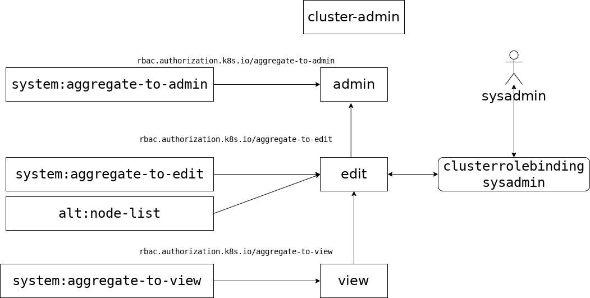

# Настройка рабочих мест администраторов информационной (автоматизированной) системы (ClusterRole)

## Создание рабочего места администратора информационной (автоматизированной) системы

Создадим рабочее место администратора информационной (автоматизированной) системы с именем `sysadmin`.
Для этого установим переменную `USER`:
```
$ export USER=sysadmin
```
и выполним пункты раздела [Создание рабочих мест и сертификатов](https://gitea.basealt.ru/kaf/RBAC/src/branch/main/addUser/create-user.md) за исключением последнего пункта **Восстановление прав доступа к файлам конфигурации созданного пользователя**.

## Формирование кластерной роли и связывание ее с пользователем

Так как *администратору информационной (автоматизированной) системы* требует доступ по всем ресурсам кластера, то для него надо использовать кластерную роль.

Кластерная роль `cluster-admin` предоставляет неограниченные прав, которые не подходят для *администратора информационной (автоматизированной) системы*, так как будут совпадать с правами *администратор безопасности средства контейнеризации*.

Кластерная роль `admin` также не подходит, так позволяет создавать роли и предоставлять их пользователям, что является прерогативой *администратора безопасности средства контейнеризации*.

Наиболее подходящая для *администратора информационной (автоматизированной) системы* роль - `edit`.

### Модификация кластерной роли edit

Кластерная роль `edit` не позволяет просматривать список узлов кластера. Расширим данную роль объединив ее с созданной нами кластерной ролью `alt:node-list`.

Для этого создадим кластерную роль `alt:node-list`:
```
$ kubectl create clusterrole alt:node-list --verb=get,list,watch --resource=node --dry-run=client -o yaml > alt-node-list.yaml
```
Рассмотрим созданный файл описания роли `alt-node-list.yaml`:
```
apiVersion: rbac.authorization.k8s.io/v1
kind: ClusterRole
metadata:
  creationTimestamp: null
  name: alt:node-list
rules:
- apiGroups:
  - ""
  resources:
  - nodes
  verbs:
  - get
  - list
  - watch
```
Данная кластерная роль позволяет для узлов (`nodes`) просматривать их список и содержимое.

Модифицируем данную роль для включения ее в роль `edit` включив в нее метку `rbac.authorization.k8s.io/aggregate-to-edit: "true"`:
```
apiVersion: rbac.authorization.k8s.io/v1
kind: ClusterRole
metadata:
  name: alt:node-list
  labels:
    rbac.authorization.k8s.io/aggregate-to-edit: "true"   
rules:
- apiGroups:
  - ""
  resources:
  - nodes
  verbs:
  - get
  - list
  - watch
```
Добавим роль:
```
$ kubectl apply -f alt-node-list.yaml
clusterrole.rbac.authorization.k8s.io/alt:node-list created
```

Свяжем модифицированную кластерную роль `edit` с пользователем `sysadmin`:
```
$ kubectl create clusterrolebinding sysadmin --clusterrole=edit --user=sysadmin
clusterrolebinding.rbac.authorization.k8s.io/sysadmin created
```




Просмотрим созданную связку в формате `yaml`:
```
$ kubectl get  clusterrolebinding sysadmin -o yaml
apiVersion: rbac.authorization.k8s.io/v1
kind: ClusterRoleBinding
metadata:
  creationTimestamp: "2023-02-26T15:14:06Z"
  name: sysadmin
  resourceVersion: "833139"
  uid: c8833b17-970f-4f1e-8a9b-e52e324a61a1
roleRef:
  apiGroup: rbac.authorization.k8s.io
  kind: ClusterRole
  name: edit
subjects:
- apiGroup: rbac.authorization.k8s.io
  kind: User
  name: sysadmin
```
Она привязывает модифицированную роль `edit` к пользователю `sysadmin`.

## Проверка привязки роли

```
# переход в контекс пользователя sysadmin - администратор информационной (автоматизированной) системы
$ kubectl config use-context sysadmin 
Switched to context "sysadmin".
# Получение списка Pos'ов
$ kubectl get pods
NAME   READY   STATUS    RESTARTS   AGE
...
# Получение списка узлов
$ kubectl get nodes
NAME       STATUS   ROLES           AGE   VERSION
...
# возврат в контекс пользователя kubernetes-admin@kubernetes - администратор безопасности средства контейнеризации
$ kubectl config use-context kubernetes-admin@kubernetes 
```

## Восстановление прав доступа к файлам конфигурации созданного пользователя

В конце не забудьте ужесточить права доступа к файлам  конфигурации созданного пользователя:
```
$ cd ~
$ sudo chmod -R 700 $KUBECONFIGDIR
$ sudo chmod 700 $USERDIR
```

**Сcылки**:
* [Kubernetes RBAC 101: authorization](https://www.cncf.io/blog/2020/08/28/kubernetes-rbac-101-authorization/)