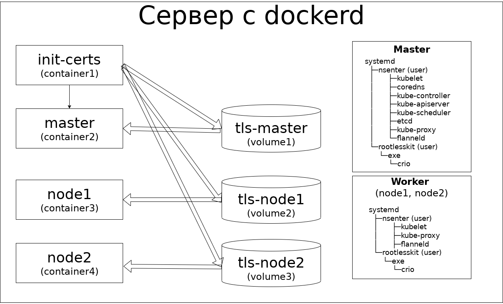
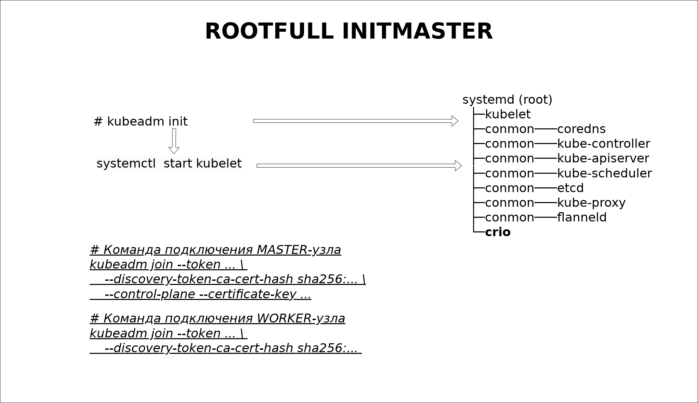
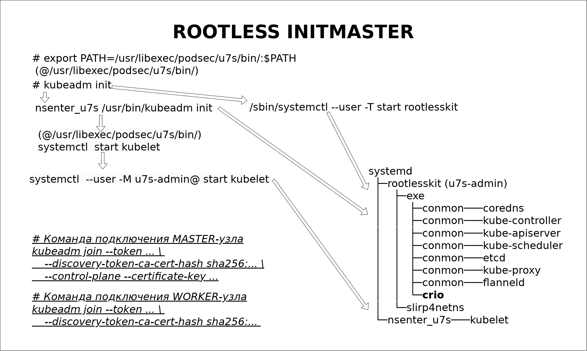
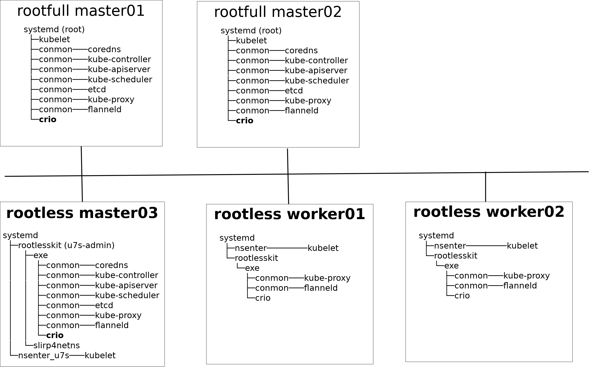

## Аннотация

*В докладе рассматриваются вопросы одной из первых реализаций rootless kubernetes в рамках ALTLinux-пакетов защиты контейнерных решений podsec (Podman Security). Сравнение rootless и rootfull решения. Особенности реализации rootless решения. Механизмы защиты от несанционированного доступа и использования уязвимостей.*

Реализация `rootless kubernetes` была сделана на основе проекта [Usernetes](https://github.com/rootless-containers/usernetes).

## Базовое решение Usernetes

Отличие данного решения от стандартного `rootfull`-решения:

- Основные программы (`kube-apiserver`, `kube-controller`, `kube-scheduler`, `kube-proxy`, `coredns`, `etcd`, ...) запускаются в виде сервисов, а не в виде контейнеров.

- Сертификаты генерируются сторонней программой (`cfssl`) и помещаются в тома доступные узлам кластера.

Достоинства данного решения:

- Позволяет разворачивать rootless kubernetes в одноузловом или кластерном варианте.

- Обеспечивает быстрое тестирование решения путем разворачивания `rootless kubernetes` в виде стека сервисов (`docker-compose`) в рамках одного сервера.

В то же время это решение носит эксперементальный характер, что предопределило следующие
недостатки:

- Генерация сертификатов производится программой `cfssl`, отсутствующей в репозитории пакетов `ALTLinux`.

- Для создания и доступа к сертификатам необходимо использовать либо `docker-тома` либо `разделяемую файловую систему`.

- Решение создается без использования стандартной команды разворачивания кластера `kubeadm`, что ограничивает варианты разворачивания решения в виде кластера.

- Решение поднимается либо в виде стека сервисов (`docker-compose`) в рамках одного сервера либо требует создание `разделяемого тома` в рамках кластера для доступа к сертификатам.

- Процедуры добавления, удаления узлов в кластер, обновления сертификатов нестандартные и требуют дополнительной квалификации от системного администратора.

- Реализация основных компонент кластера в виде сервисов, а не в виде контейнеров (`POD`'ов) несет потенциальные риски при обновлении версий `kubernetes`, так как требует анализа возможных изменений в образах новых версий `kubernetes`.

##  Стандартная схема разворачивания rootfull kubernetes кластера через команду kubeadm

Для снятия основных недостатков необходимо было реализовать на основе `Usernetes` вариант разворачивания `rootless kubernetes`-кластера через стандартную программу `kubernetes` - `kubeadm`.

Процесс разворачивания `rootfull-кластера` через `kubeadm` выгладит следующим образом:

При запуска на начальном (`Init`) `Master`(`ControlPlane`) узле `kubeadm init` производит следующие основные  действия:

- Загружает с регистратора все необходимые (`kube-apiserver`, `kube-controller`, `kube-scheduler`, `kube-proxy`, `coredns`, `etcd`, ...) `kubernetes`-образы.

- Запускает через `systemctl start kubelet` сервис `kubelet`.

- Генерирует сертификаты и kubernet-манифесты в каталоге `/etc/kubernetes/manifests/`.

- Поднимает через `kubelet` основные контейнеры (`POD`'ы).

- Конфигурирует одно-узловой кластер и записывает его конфигурацию в `etcd`.

- Генерирует строки подключения (`kubeadm join ...`) к кластеру `ControlPlane` и `Worker` узлов.

Для подключения дополнительных узлов на них запускаются команда `kubeadm join ...` с указанными параметрами.

## Разворачивание rootless кластера через команду kubeadm

Реализованный в рамках ALTLinux пакет [podsec-k8s](https://github.com/alt-cloud/podsec) - это набор скриптов, который позволяет разворачивать rootless-кластер стандартной немодифицированной бинарной командой `kubeadm`.

Все разворачиваемые процессы в `rootless kubernetes кластере` запускаются в `user namespace` системного пользователя `u7s-admin`, обладающего обычными (непривилигированными) правами. Таким образом, все `POD`'ы имют права обычного непривилигированного пользователя и не могут при взломе повлиять на функционирование узла.

### Разворачивание (`Init`) `Master`(`ControlPlane`) rootless узла

Скрипты пакета `podsec-k8s` находятся в каталоге `/usr/libexec/podsec/u7s/bin`. Часть из них (`kubeadm`, `systemctl`) являются оболочками над стандартными командами системы с аналогичным именем.
За счет установки переменной `PATH`:
<pre>
export PATH=/usr/libexec/podsec/u7s/bin/:$PATH
</pre>
они вызываются до вызова основных системных команд `kubeadm` и `systemctl` и после выполнения настройки среды вызывают основные системные команды.

При запуске на начальном (`Init`) `Master`(`ControlPlane`) узле скрипт `kubeadm init` производит следующие основные  действия:

- В окружении пользователя `u7s-admin` запускает сервис `rootlesskit`, который позволяет запускать процессы правами "превдоroot".
  Процессы в рамках `user namespace` пользователя `u7s-admin` имеют права `root` (`UID=0`), могут создавать сетевые интерфейсы, настраивать правила маршрутизации `iptables` и выполнять другие системные действия, но в рамках `HOST-системы` все производимые действия изолируются в `user namespace` пользователя `u7s-admin` и ниак не взаимосвязаны с системными ресурсами HOST-системы.
  В процессе `rootlesskit` в рамках `user namespace` пользователя `u7s-admin` запускаются:

     * подпроцесс `crio`, обеспечивающий работу с контейнерами.

     * подпроцесс `slirp4net`, обеспечивающий создание сетевых интерфейсов и работу с ними.

- В рамках `user namespace` пользователя `u7s-admin` запускаются стандартная бинарная команда `kubeadm`
  <pre>
  nsenter_u7s /usr/bin/kubeadm init
  </pre>

    В рамках этого `namespace` команда `kubeadm` имеет права `пседвоroot`:

    - Загружает с регистратора все необходимые (`kube-apiserver`, `kube-controller`, `kube-scheduler`, `kube-proxy`, `coredns`, `etcd`, ...) `kubernetes`-образы.

    - Запускает через `systemctl start kubelet` сервис `kubelet`.

    - Генерирует сертификаты и kubernet-манифесты в каталоге `/etc/kubernetes/manifests/`.

    - Поднимает через `kubelet` основные контейнеры (`POD`'ы).

    - Конфигурирует одно-узловой кластер и записывает его конфигурацию в `etcd`.

    - Генерирует строки подключения (`kubeadm join ...`) к кластеру `ControlPlane` и `Worker` узлов.

- Производит настройку интерфейсов и правил `iptables` в HOST-системе и `user namespace` пользователя `u7s-admin`

- Производит настройку файлов конфигурации (`.kube/config`) пользователей `root` и `u7s-admin`.

Таким образом, при запуска скрипта `kubeadm` пакета `podsec-k8s` производится полноценная настройка `Master` (`ControlPlane`) узла `rootless кластера`.

### Подключение дополнительных ControlPlane и Worker узлов

Подключение дополнительных ControlPlane и Worker узлов производится аналогичным образом:

- Устанавливается пакет `podsec-k8s`.

- Устанавливается переменная среды `PATH`:
  <pre>
  export PATH=/usr/libexec/podsec/u7s/bin/:$PATH
  </pre>

- Запускается скрипт 'kubeadm' пакета `podsec-k8s` в режиме `kubeadm join ...` с параметрами, сгенерированными при установке начального `Master` (`ControlPlane`) узла.

## "RootFullLess" кластера kubernetes

В рамках одного кластера могут функционировать как `rootfull`, так и `rootless` ControlPlane и `Worker` узлы.
Этот вариант можно использовать как для постоянной работы (запустив все `Worker`узлы в режиме `rootless`), так и как переходный режим при последовательной замене `rootfull` узлов кластера на `rootless` узлы.

## Группа пакетов podsec (Podman Security)

Пакет **podsec-k8s** входит в состав группы пакетов:

- **podsec**

    * Разворачивание локального регистратора (`regitry.local`) и сервера подписей (`sigstore.local`).

    * Создание пользователей группы `podsec-dev`, имеющих права на создание docker-образов, их подписывание и размещение в локальном регистраторе.

    * Создание пользователей группы `podsec`, имеющих возможность запуска подписанных образов с локального регистратора. Работа с образами из других источников не допускается.

    * Настройка политик доступа и работы с образами различным группам пользователей.

    * Загрузка и обновление новых версий `kubernetes` с регистратора `registry.altlinux.org`, их архивирование, подпись и размещение их на локальном регистраторе.

- **podsec-k8s-rbac**:

    * Создание удаленных рабочих мест с генерацией сертификатов для доступа к `rootfull` или `rootless`  `kubernetes` кластеру.

    * Создание привязки (`bind`) пользователя к обычной или кластерной роли.

    * Просмотр списка связанных с пользователем ролей.

    * Удаление привязки (`bind`) пользователя к обычной или кластерной роли.

- **podsec-inotify**:

    * Автоматический мониторинг политик безопасности на узлах кластера и рабочих местах пользователей.

    * Контроль несанкционированного доступа к `API` `kubernetes` кластера.

    * Мониторинг docker-образов узла сканером безопасности `trivy`.

## Ссылки

- PODSEC (Podman Security) - https://github.com/alt-cloud/podsec;

- Rootless kubernetes - https://www.altlinux.org/Rootless_kubernetes

- Usernetes: Kubernetes without the root privileges - https://github.com/rootless-containers/usernetes

- slirp4netns: User-mode networking for unprivileged network namespaces - https://github.com/rootless-containers/slirp4netns
