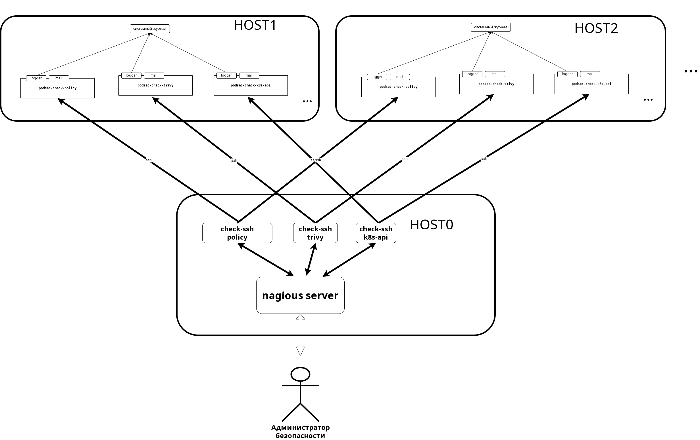

# Описание nagios-скриптов мониторинга безопасности

## Схема вызовов скриптов

На стороне `nagios-сервера` (`HOST0`) конфигурируется:

* группа серверов мониторинга (`HOST1`, `HOST2`, ...)

* сервисы мониторинга для созданной группы серверов (`policy`, `trivy`, `k8s-api`, ...) с параметрами для `классификации уровней безпасностей` как по `шкале nagios`, так и по `шкале системных логов` (см. ниже раздел * Классификация метрики по уровням*).

* расписане вызовов сервисов.

Согласно расписанию nagios через плугин `check_ssh` производит удаленный вызов скриптов мониторинга безопасности на каждом из сервером `группы мониторинга`.
Скрипты мониторинга:

- анализируют предметную область и определяют метрику уровня опсаности;

- на основе переданных при вызове параметров (см. ниже раздел *Классификация метрики по уровням*) определяют уровень опасности как по `шкале системных логов`, так пои по `шкале nagios`.

- по системным логам:

    * если уровень сообщения в рамках `шкалы системных логов`, формируется сообщение и с помощью `logger` выводится в системный лог.
    * если уровень опасности вне рамок уровней шкалы сообщение в `системный лог` не передается.

- по `nagios`:

    * если уровень опасности в рамках уровней шкалы `nagios` (`warning`, `critical`) формируется сообщение, выводится на стандартный
 выход, скрипт завершается с соответствующим кодом завершения (`warning` - `1`, `critical` - `2`).
    * если уровень опасности вне рамок уровней шкалы `nagios` формируется сообщение, выводится на стандартный
 выход, скрипт завершается с кодом завершения `0`.

## Преимущества решения

- на стороне анализируемого хоста  не надо:

    * поднимать  `nagios-nrpe` и `nagios-addons-nrpe`;
    * устанавливать пакет `nagwad` анализа логов `journal` 
    * писать скрипты анализа системных логов и трансляции их в формат `nagios`;

- за счет использования параметров для определения уровней опасности по `шкале системных логов` и по `шкале nagios` данный механизм не *вшивается* в код, а позволяет гибко конфигурировать систему по уровням безопасности во время разворачивания решения.

- на стороне анализируемого сервера не надо запускать программы мониторинга через cron. Функции cron будет выполняет `nagios` с гибкой системой конфигурирования расписания удаленных вызовов скриптов мониторинга;

- в случае разворачивания без `nagios` настройку расписания вызово на локальном узле можно осуществить через `cron`.

## Недостатки решения

Пользователя `nagios` для возможности вызова скриптов от имени суперпользователя необходимо включить в группу `whetl`, что нескольно понижает защищенность системы.
Хотя в случае использования `nagios-nrpe` систему с большим успехом можно "поломать", используя уязвимости `nagios-nrpe`

## Вызов скриптов

Скрипты могуть вызываться двумя способыми:

* как `nagios-plugin` вызываемый со стороны `nagios-сервера` как сервис через `check_ssh plugin`

* при отсутствии `nagios-сервера` через cron

Скрипт:

* анализирует предметную область и формирует определенное число - метрику(положительное целое число), оперделяющее уровень опасности ситуации.

* исходя из полученной метрики скрипт классифицирует уровень опасности по двум шкалам:

  - системные логи - 6 уровней:  
    * отладочный (`Debug:`);
    * средний (`Middle:`)
    * высокий (`High:`)
    * критический (`Critical:`)
    * фатальный (`Fatal:`)
    * аварийный (`Crash:`)

  - `nagios` - 4 уровня (см. https://nagios-plugins.org/doc/guidelines.html#AEN78):

     Код_завершения |	Статус серсиса | Описание статуса
      --------------|----------------|-------------------
      0             |     OK         | Плагин смог проверить сервис, сервис работает нормально.
      1             |   Warning      | Плагин смог проверить сервис и оказалось, что он выше некоторого «предупреждающего» порога или не работает должным образом.
      2             | Critical       | Плагин обнаружил, что служба либо не запущена, либо выше некоторого «критического» порога.
      3             |  Unknown       | Неверные аргументы командной строки были переданы подключаемому модулю или низкоуровневые внутренние сбои подключаемого модуля (например, невозможность разветвления или открытия сокета tcp), препятствующие выполнению указанной операции. Ошибки более высокого уровня (например, ошибки разрешения имен, тайм-ауты сокетов и т. д.) находятся вне контроля плагинов и, как правило, НЕ должны сообщаться как НЕИЗВЕСТНЫЕ состояния.

* посылает сообщение в два канала:

  - для системных логов скрипт формирует одно-строковое сообщения и добавив префикс уровня системных логов с помощью программы `logger` посылает его в истемный лог;

  - для сервера `nagios` формирует одно- или многострочное сообщение формата (см. https://nagios-plugins.org/doc/guidelines.html#PLUGOUTPUT):
    <pre>
     Код_завершения: Первая строка вывода | Первая часть данных о производительности
     Любое количество последующих строк вывода, но учтите, что буфер может иметь ограниченный размер | Вторая часть данных о производительности, которая также могут иметь линии продолжения
    </pre>

* завершается с кодом_завершения (exit n) уровня nagios

## Классификация метрики по уровням

Классификация метрики по уровням производится с помощью параметров описания интервалов, передаваемых скрипту во время вызова.

Формат параметров:
<pre>
<флаг> <интервал>
</pre>

Где `<интервал>` задается в формате `nagios`. См. [Threshold and Ranges](https://nagios-plugins.org/doc/guidelines.html#THRESHOLDFORMAT).

- Уровни системных логов:

    Уровень       |  Флаг
    --------------|--------
    `аварийный`   | `-a`
    `фатальный`   | `-f`
    `критический` | `-a`
    `высокий`     | `-h`
    `средний`     | `-m`
    `низкий`      | `-l`
    `отладочный`  | `-d`

      Если метрика попадает в задаваемые интервалы формируется сообщение в системный лог с полученным префиксом (в случае перекрывания интервалов будет с наивысшим уровнем).
      Если метрика не попадает в задаваемые интервалы сообщение в системный лог не передается.

- Уровни логов nagios:

    Уровень       | Код_завершения | Флаг
    --------------|----------------|-----
    `критический` | 2              | `-c` (совпадает с уровнем `критический` системных логов)
    `предупреждение` | 1           | `-w`

    Если  метрика не попадает в задаваемые интервалы формируется код завершения `0`.
    Если `shell-скрипт` завершился аварийно он с помощью `trap`  выводит на стандартный вывод сообщение `nagios` и завершается с кодом завершения `3`.

