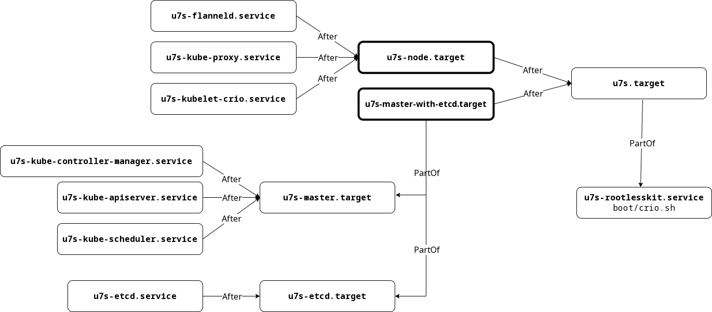

# Различия master и worker's на u7s

Стартовые скрипты:

Узел  |Ожидание генерации сертфикатов | Целевой systemd сервис | cidr   | publishPorts | cni | cri
------|-------------------------------|------------------------|--------|--------------|-----|-----
master| --wait-init-certs | u7s-master-with-etcd.target | 10.0.100.0/24 | 2379/tcp(etcd), 6443/tcp(api)        | flannel | crio
crio1 | --wait-init-certs | u7s-node.target             | 10.0.101.0/24 | 10250/tcp(coredns), 8472/udp(flannel)| flannel | crio
crio2 | --wait-init-certs | u7s-node.target             | 10.0.101.0/24 | 10250/tcp(coredns), 8472/udp(flannel)| flannel | crio

## Различия systemd-сервисов master и worker's на u7s

* **systemd**:

    * **flanneld.sh/nsenter/**

        master   |  crio1   |  crio2
         --------|----------|----------
         &nbsp;  | flanneld | flanneld

    * **nsenter.sh/nsenter/**:

        master  |  crio1   |  crio2
        --------|----------|----------
         etcd   |   &nbsp; |   &nbsp;
        kube-apiserver | &nbsp; | &nbsp;
        kube-scheduler |  &nbsp;  | &nbsp;
        &nbsp;  | kubelet | kubelet
        &nbsp;  | kube-proxy | kube-proxy

    * **/rootlesskit.sh/rootlesskit/**:

        master  |  crio1   |  crio2
        --------|----------|----------
        slirp4netns | slirp4netns | slirp4netns

        * **exe/**:

            master  |  crio1   |  crio2
          --------|----------|----------
          &nbsp;  | fuse-overlayfs | fuse-overlayfs

            * **rootlesskit.sh/**:

                master  |  crio1   |  crio2
                --------|----------|----------
                crio   | crio     | crio

            * **conmon/**:

                master  |  crio1   |  crio2
                --------|----------|----------
                &nbsp;       | coredns  | coredns
                &nbsp;      | nginx... | nginx... (Pods+)

